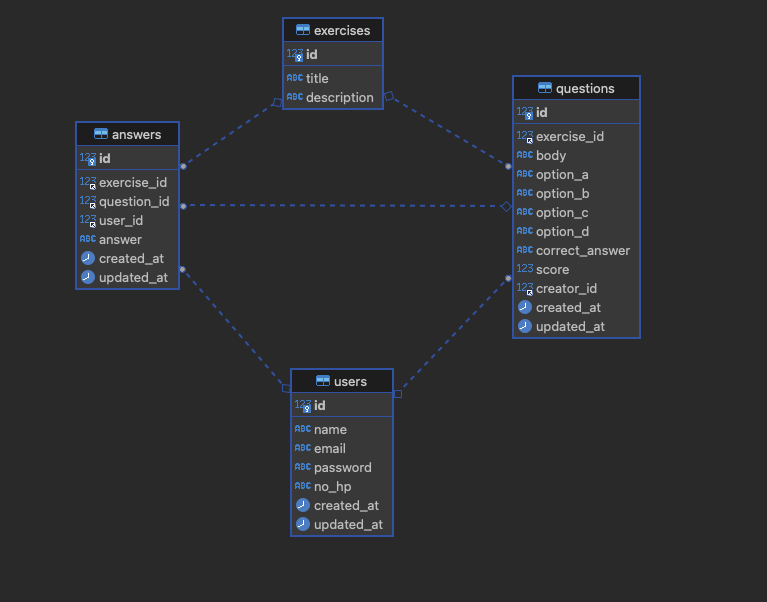

# course

## Note

Hi Edspert, berikut ini adalah tugas untuk membuat API di pertemuan sebelumnya. Di tugas ini saya mencoba membuat kembali semua endpoint dari yang sudah di buat di zoom meet dan yang belum, saya coba membuat kembali dengan logic saya sendiri, tapi tentu banyak refrensi yang saya gunakan

Karena sebelumnya dibahas tentang clean architecture, akhirnya saya coba cari tahu dan project berikut saya tulis dengan refrensi [go-clean-arch](https://github.com/bxcodec/go-clean-arch)

Karena saya masih baru belajar golang jadi di project ini saya masih meraba-raba dan masih belum tahu apakah code yang saya tulis sudah bisa dianggap clean architecture dan apakah sudah efisien, jadi tolong jika ada yang kurang tepat ataupun saya ada melakukan kesalahan maka bisa berikan saya kritik & saran agar saya bisa lebih maju

Oh iya di project ini saya juga mengalami kendala saat membuat route get score, saat saya membuat route ini terdapat error "conflicts with existing wildcard", kemungkinan hal ini terjadi karena di method GET sudah ada endpoint wildcard "/exercises/*"

Saya sudah coba beberapa cara seperti membuat grouping atau noroute di gin tetapi hasilnya masih belum sesuai, jadi saya ubah endpoint get score :

- Before: /exercises/{{exercisesID}}/score
- After: /exercise/{{exercisesID}}/score

Terimakasih :)

## How to run & build
- go run app/main.go
- go build app/main.go

## Package
- Database
    - [gorm](https://gorm.io/)
- Routing framework
    - [gin gonic](https://gin-gonic.com/)

## Dependencies
- mysql
- golang
- godotenv
- logurus
- copier

## API Documentation
can check this  using [swagger](https://editor.swagger.io/) 

## API
- create register user
- create user login
- get exercise question
- calculate answer
- create exercise (tugas)
- create question (tugas)
- create answer (tugas)

## DB Schema
